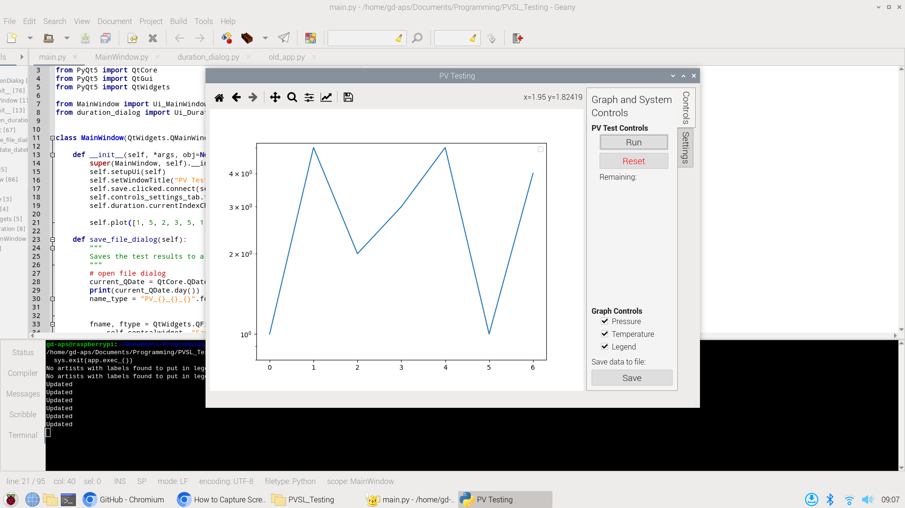
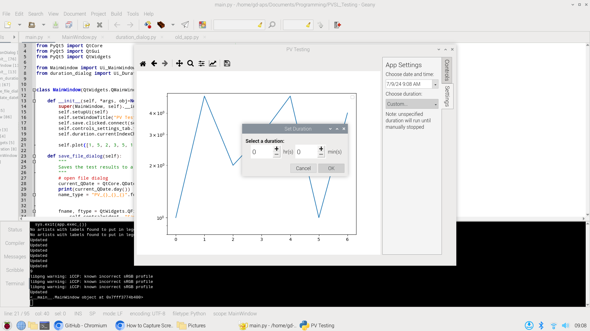
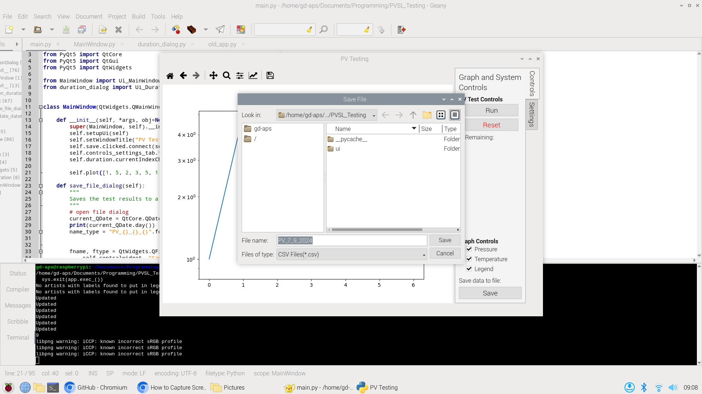

# Welcome to the Pressure Vessel Slow Leak (PVSL) Testing Repo
This is the respository that will be used for storing all of the software and scripts for the automated PV testing.
The project integrates multiple different aspects, including computer and electrical engineering, software development,
PCB design, and some mechanics.

## Goal
The goal for this project is to create a system that can automatically detect leaks in naval pressure vessels. This is
accomplished by using an absolute pressure transducer and a resistance temperature detector (RTD) to determine whether
pressure will fluctuate during a given time period.

The code and software on this repository will be run on a Raspberry Pi 5 and will log the varying temperature and
pressure readings. The frontend is handled by PyQt5 with graphing capabilities being handled by matplotlib and numpy.
Backend will most likely be handled by Python or C for processing with a pipe to transmit sensor data.
The UI (with exception to matplotlib and associated navigation bar) were
made using QtDesigner. The UI files are found in .ui directory.

```txt
main --+--> pyqtgraph (main)
       |
       +--> matplotlib 
```
## TODO
- [ ] Acquire sensors
  - [ ] RTD acquired
  - [x] Transducer acquired
- [ ] Calibrate sensors
- [ ] Design receivers to turn current mode to voltage
- [ ] Create (low pass) filters to filter higher frequency noise
- [ ] Create board for sensors, ADC, filters, amplifiers, etc.
- [x] Finish frontend app with QtDesigner (done for now)
- [x] Add save file/path functionality for data to CSV
  - [x] Make it decent :)
- [x] Create dialog when test time set to custom
  - [x] Add save time functionality
  - [x] Display time instead of "custom"
- [ ] Add backend files to pull data from sensors from ADC on Raspberry Pi
- [x] Refactorize ui and main files :)
- [ ] Substitute matplotlib for pyqtgraph?

## Screenshots

_Front page of the application_

_Duration selection dialog_

_File selection dialog (native Qt)_
